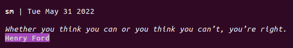

# quotes-elsanti



Very simple CLI package to get a quote.


The content is originally found [here](https://gist.github.com/signed0/d70780518341e1396e11) and modified by [this user](https://gist.github.com/dmakk767/9375ff01aff76f1788aead1df9a66338) and by me.

## Install and Execute

```
//Install
npm i quotes-elsanti -g

// and just run
qes
```


Or locally `npm i quotes-elsanti` and either:
* add to the path variable
* or execute it as `npx qes` to run a local version.
* or execute manually `./path/to/quotes-elsanti/src/index.js`.

Executing with the word full as `qes full` gives also the date. Otherwise just quote and author.

<!--
## Learn by doing

This is a simple project where I write a small JS program and:

1. Create a Github repo - use git version control
2. Publish to npm
3. Test using different testing libraries
4. Add continuous integration
5. Use newest ES features
6. Transpile with babel
7. Bundle code with Webpack
8. Get it ready for Node and Browser.

You can look at it and try to do it too.
-->
